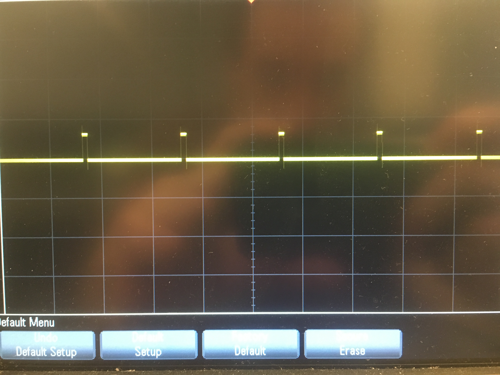
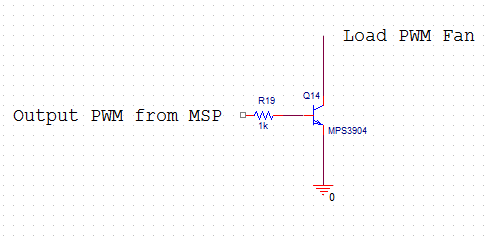

# Lab 6: "High Power" Control
Relay and Mosfet Switching circuits can both be used to control higher voltages with lower voltages. 
These devices can help prevent damage to a microcontroller by preventing a direct connection to a load

## Relay Switching
The MSP430G2553 was used to output a PWM signal to the 12V relay in order to control the voltage dropped across a power resistor.
It was found that the turn on voltage where the relay would switch was 7V. When the relay was turned on, the current through the circuit was measured to be 5.2mA.
This is still less that the 6mA current draw limit for the MSP430 so the microcontroller wasn't damaged.
It was found that the relay could switch up to 60Hz reliably. 

### Pwm Graph
 

## MOSFET Switching
The relay was replaced with a MOSFET and the current running through the circuit was 3.4mA. The gate of the MOSFET draws zero current ideally so this contributes to the decrease in current draw.
The MOSFET could also switch faster at a lower turn on voltage compared to the relay.

 

## MSP430G2553 Code
```c
/*
Matt Mammarelli
9/18/17
ECE 09342-2
*/

//MSP430G2553 Software PWM
//green led toggles when button pressed
//red led affected by PWM
//need p1sel


#include <msp430.h>

void ledSetup();
void buttonSetup();
void timerSetup();


void main(void){

    // Stop watchdog timer
    WDTCTL = WDTPW + WDTHOLD;


    ledSetup(); //init leds
    buttonSetup(); //init buttons
    timerSetup(); //init timer

    _BIS_SR(LPM0_bits + GIE);       //Enter low power mode

}


void ledSetup(){

    //selects gpio mode for both leds
        P1SEL &= ~(BIT0|BIT6);


        //red,green led out
        P1DIR |= (BIT0|BIT6);


        //makes sure green led is off
        P1OUT &= ~(BIT6);


}
void buttonSetup(){

    //resistor enabled input
       P1REN |= BIT3;

       //Sets Resistor to pullup, 1.0 is low, has to use = to initialize
       P1OUT = BIT3;


       P1IE |=BIT3; //enable interrupt on port 1.3
       P1IES |=BIT3; //sets as falling edge
       P1IFG &=~(BIT3);//clear interrupt flag

}
void timerSetup(){

    // SMCLK, Up Mode (Counts to TA0CCR0)
        TA0CTL |= TASSEL_2 + MC_1;

        //sets cctl1 and 0 to compare mode
        TA0CCTL1 = (CCIE);
        TA0CCTL0 = (CCIE);

        // PWM period, f=1MHz/1001 = 1khz
        TA0CCR0 = 1000;
        // TA0CCR1 PWM 50% duty cycle
        TA0CCR1 = 500;


}

//button interrupt
#pragma vector=PORT1_VECTOR
__interrupt void Port_5(void) {

    if (!((P1IN & BIT3) == BIT3)){
               P1OUT^=BIT6; //toggle green led

               if (TA0CCR1<=1000){
                   TA0CCR1 = TA0CCR1+100; //increments red led duty cycle

               }
               else {
                   TA0CCR1 = 0; //resets duty cycle back to 0%
               }
           }

           //clears interrupt flag to exit interrupt
           P1IFG &= ~BIT3;
}


//Timer A interrupt vectors
#pragma vector=TIMER0_A1_VECTOR
__interrupt void Timer0_A1_ISR (void)
{
    if(TA0CCR1 != 1000)
    {
       P1OUT &= ~(BIT0); //turns off red led
    }
    TA0CCTL1 &= ~BIT0; //clears flag
}

#pragma vector=TIMER0_A0_VECTOR
__interrupt void Timer0_A0_ISR (void)
{
    P1OUT |= (BIT0); //turns on red led
    TA0CCTL0 &= ~BIT0;  //clears flag
}


```

## Best Solution
A MOSFET would be the best solution because there is almost no current draw on the gate from the MSP and because it switches faster since it isn't electromechanical.


