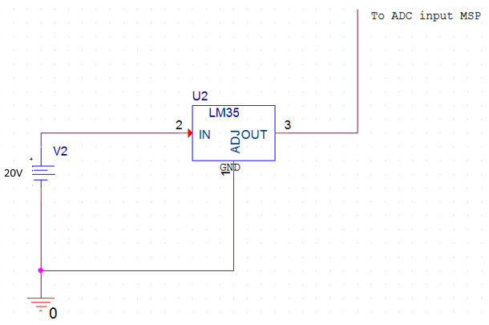

# Lab 6: Open Loop Systems
This Open loop system will receive a temperature over UART, convert it to a duty cycle, and send that duty cycle to a PWM fan. 
This system does not require feedback from the temperature sensor for error correction.

## Voltage Regulator
A 5V Regulator was used with a 12V input and a 50 ohm load so it would heat up.

### Regulator Voltage


Shows that the regulator is outputting 5V.

## Temperature Sensor
A LM35 Temperature sensor was used in order to measure the temperature on the regulator.
This temperature was transmitted over UART every 1 second in order to easily visualize the system.

## Fan Control
The fan used was a PWM fan and had three inputs that needed to be connected.
The yellow connects to 12V, the black connects to ground, and the blue connects to the PWM output from the MSP.
It was found that you can never completely turn off a PWM fan, you can just make it spin slowly.

### Room Temperature


The room temperature was measured at a standard 22.2C.

### Fan Setup


## Temperature Reading UART
An ADC input was used on the MSP430F5529 to read in the temperature values from the LM35 and displayed over UART.


Temperature Sensor was set so it was touching the 5V regulator to increase its accuracy and response time.


## System Modeling
In order to model this system, a relationship between temperature and PWM had to be established.
This was accomplished by setting the PWM percentage in increments of 10% and waiting until the LM35 reached a steady state.
This steady state was recorded and a graph was created for each Duty Cycle.


## Schematics

### Low Side Switch for PWM Fan


### Temperature Sensor Circuit


### 5V Regulator Circuit


## MSP430F5529 Code:

```c
/*
Matt Mammarelli
9/18/17
ECE 09342-2
*/

//Open Loop Control MSP430F5529
//Receives a duty cycle over UART, sends the pwm over GPIO pin 1.2
//Receives temperature from ADC12, puts into array of values 
//Transmits temperature over UART when Timer B ISR fires, about every 1 second


#include <msp430f5529.h>


int pwm=0; //holds UART values for current rgb
int temp[10]; //array to hold temperatures
int count =0; //iterates through temperature array

void main(void)
{

  //stop watchdog timer
  WDTCTL = WDTPW + WDTHOLD;

  //uart **************************************************************************************************
  // P3.3, P3.4 transmit/receive
  P3SEL = BIT3+BIT4;
  // Put state machine in reset
  UCA0CTL1 |= UCSWRST;
  // SMCLK
  UCA0CTL1 |= UCSSEL_2;
  // 1MHz 9600 baud
  UCA0BR0 = 6;
  // 1MHz 9600
  UCA0BR1 = 0;
  //sets m control register
  UCA0MCTL = UCBRS_0 + UCBRF_13 + UCOS16;
  //sets control register
  UCA0CTL1 &= ~UCSWRST;
  //enable interrupt
  UCA0IE |= UCRXIE;
  //*******************************************************************************************************

  //adc ***********************************************************************************************

    ADC12CTL0 = ADC12SHT02 + ADC12ON;         // Sampling time, ADC12 on
    ADC12CTL1 = ADC12SHP;                     // Use sampling timer
    ADC12IE = 0x01;                           // Enable interrupt
    ADC12CTL0 |= ADC12ENC;
    P6SEL |= 0x01;                            // P6.0 ADC option select


  //**********************************************************************************************

  //rgb pwm *****************************************************************************************

  // P1.2  output
  P1DIR |= BIT2;

  // P1.2 select GPIO
  P1SEL |= BIT2;

  // PWM Period about 1khz
  TA0CCR0 = 1024;

  // CCR1 reset/set
  TA0CCTL1 = OUTMOD_7;


  // SMCLK, up mode, clear TAR
  TA0CTL = TASSEL_2 + MC_1 + TACLR;

  //***************************************************************************************************

  //timer ******************************************************************************************
  //TA0CTL = Timer A0 Control
      //TASSEL_1 Timer_A clock source select = 01 ACLK 32k
      //MC_1 Up Mode
      TB0CTL=TBSSEL_1+MC_1; //UP MODE


      TB0CCTL0 = 0x10; //Timer A0 in compare mode
      TB0CCR0=32000;
//***************************************************************************************************

  //adc
  while (1)
    {
      ADC12CTL0 |= ADC12SC;                   // Start sampling/conversion
      __bis_SR_register(LPM0_bits + GIE);     // LPM0, ADC12_ISR will force exit
      __no_operation();                       // For debugger
    }
}

//Port 1 ISR
#pragma vector = TIMER0_B0_VECTOR
__interrupt void TimerB(void) //double __
{
UCA0TXBUF = temp[count];

}


//uart interrupt vector
#pragma vector=USCI_A0_VECTOR
__interrupt void USCI_A0_ISR(void)
{
  switch(__even_in_range(UCA0IV,4))
  {
  case 0:break;   // Vector 0 - no interrupt
  case 2:{
      while (!(UCA0IFG&UCTXIFG));  // USCI_A0 TX buffer check


      pwm = UCA0RXBUF;
      // CCR1 PWM duty cycle
      TA0CCR1 = pwm * 4;
      //UCA0TXBUF = temp;

      break;

  }

  case 4:break;    // Vector 4 - TXIFG
  default: break;
  }
}

//adc12 interrupt vector
#if defined(__TI_COMPILER_VERSION__) || defined(__IAR_SYSTEMS_ICC__)
#pragma vector = ADC12_VECTOR
__interrupt void ADC12_ISR(void)
#elif defined(__GNUC__)
void __attribute__ ((interrupt(ADC12_VECTOR))) ADC12_ISR (void)
#else
#error Compiler not supported!
#endif
{
  switch(__even_in_range(ADC12IV,34))
  {
  case  0: break;                           // Vector  0:  No interrupt
  case  2: break;                           // Vector  2:  ADC overflow
  case  4: break;                           // Vector  4:  ADC timing overflow
  case  6:                                  // Vector  6:  ADC12IFG0


      temp[count] = ADC12MEM0; //changes duty cycle
	  //iterates count for temp array
      if(count<10){
          count++;
      }
      else{
          count=0;
      }


    __bic_SR_register_on_exit(LPM0_bits);   // Exit active CPU
  case  8: break;                           // Vector  8:  ADC12IFG1
  case 10: break;                           // Vector 10:  ADC12IFG2
  case 12: break;                           // Vector 12:  ADC12IFG3
  case 14: break;                           // Vector 14:  ADC12IFG4
  case 16: break;                           // Vector 16:  ADC12IFG5
  case 18: break;                           // Vector 18:  ADC12IFG6
  case 20: break;                           // Vector 20:  ADC12IFG7
  case 22: break;                           // Vector 22:  ADC12IFG8
  case 24: break;                           // Vector 24:  ADC12IFG9
  case 26: break;                           // Vector 26:  ADC12IFG10
  case 28: break;                           // Vector 28:  ADC12IFG11
  case 30: break;                           // Vector 30:  ADC12IFG12
  case 32: break;                           // Vector 32:  ADC12IFG13
  case 34: break;                           // Vector 34:  ADC12IFG14
  default: break;
  }
}


```


## Deliverables
Your README needs to contain schematics of your system, the plot of the plot of the temperature and input voltages at the 5C steps, and a brief talk about why you chose the processor you did along with the control technique for the fan. As always, you should include a brief description of the code you generated to run the experiment. You need to also include information on how to use your control software, including what inputs it is expecting and what range of values you are expecting. At this time you are not going to need to user-proof the system, but you will for the milestone, so keep it in the back of your head.

