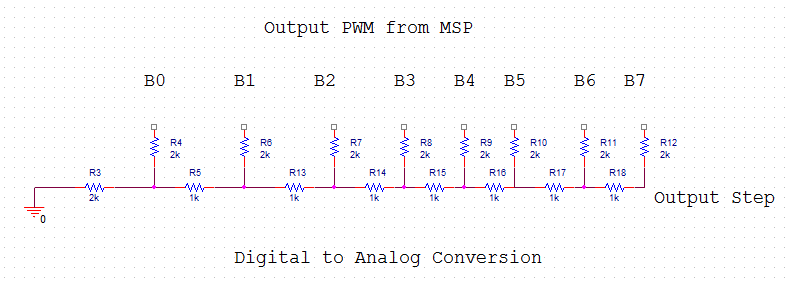
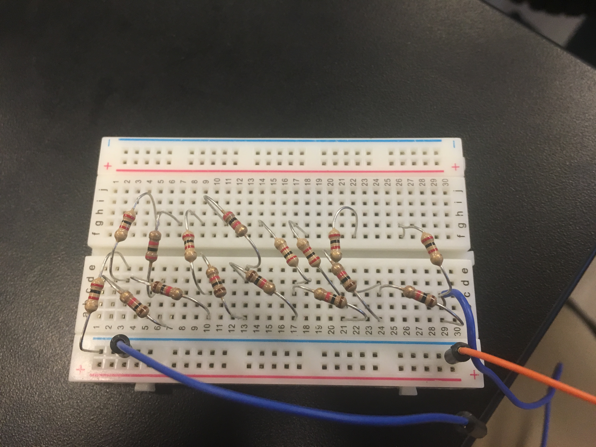
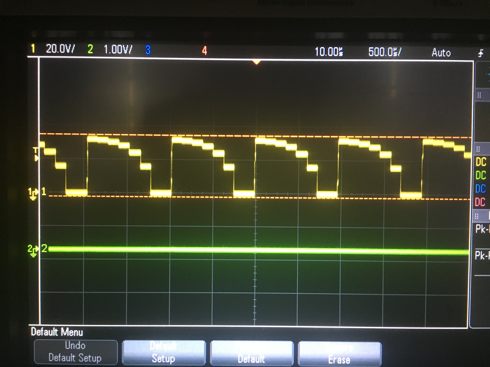
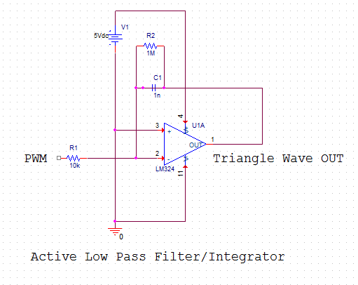
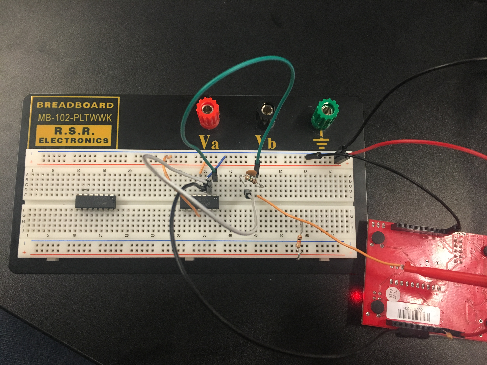
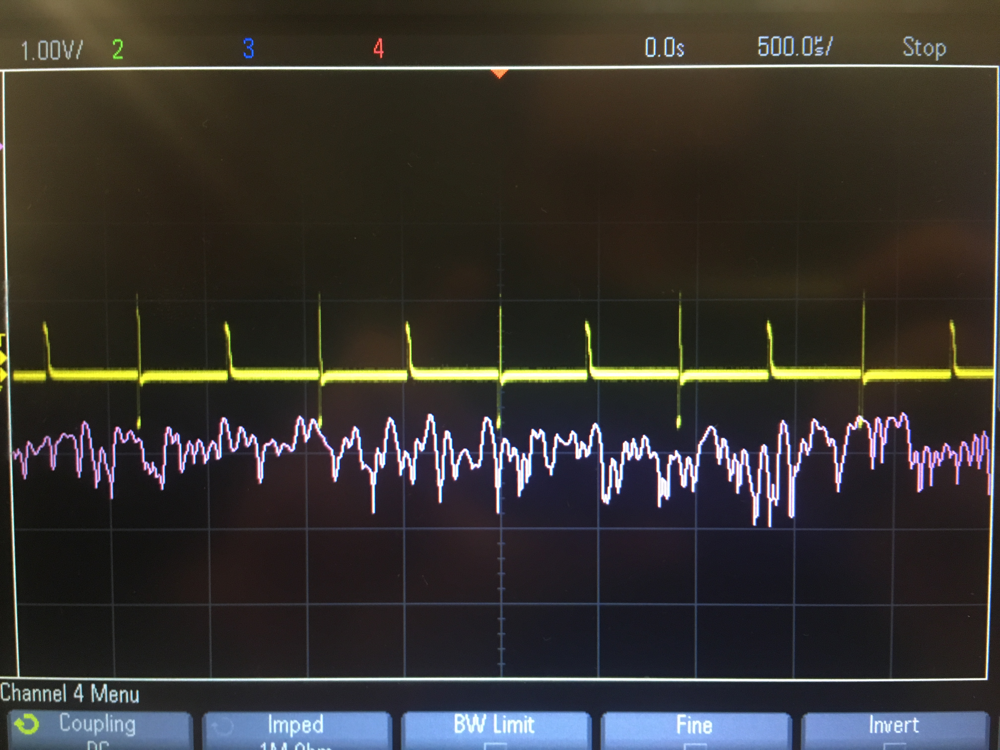
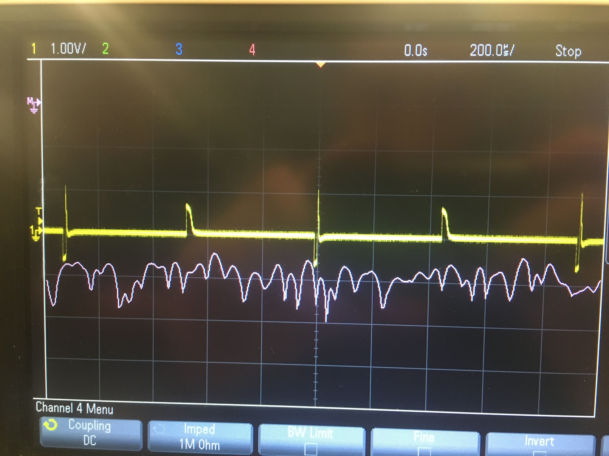

# Lab 6: Precision Control
Some applications require large amounts of voltage or current, so switching techniques must be used in order to provide the desired output. Other cases however require a finer control over the voltage or current going into them (some even require a control over resistance). So far you have looked at PWM to control the brightness of an LED, is there a way to use this to output a specified voltage or current, or even a specific waveform?

## PWM Part 2
The MSP430F5529 was used to receive a PWM signal over UART and then output that PWM on a GPIO pin to change the brightness of an led. 

### MSP430F5529 Code

```c
/*
Matt Mammarelli
9/18/17
ECE 09342-2
*/

//PWM Part 2 MSP430F5529
//Receives a duty cycle over UART, sends the pwm over GPIO pin 1.2


#include <msp430f5529.h>


int pwm=0; //holds UART values for current rgb


void main(void)
{

  //stop watchdog timer
  WDTCTL = WDTPW + WDTHOLD;

  //uart **************************************************************************************************
  // P3.3, P3.4 transmit/receive
  P3SEL = BIT3+BIT4;
  // Put state machine in reset
  UCA0CTL1 |= UCSWRST;
  // SMCLK
  UCA0CTL1 |= UCSSEL_2;
  // 1MHz 9600 baud
  UCA0BR0 = 6;
  // 1MHz 9600
  UCA0BR1 = 0;
  //sets m control register
  UCA0MCTL = UCBRS_0 + UCBRF_13 + UCOS16;
  //sets control register
  UCA0CTL1 &= ~UCSWRST;
  //enable interrupt
  UCA0IE |= UCRXIE;
  //*******************************************************************************************************


  //rgb pwm *****************************************************************************************

  // P1.2  output
  P1DIR |= BIT2;

  // P1.2 select GPIO
  P1SEL |= BIT2;

  // PWM Period about 1khz
  TA0CCR0 = 1024;

  // CCR1 reset/set
  TA0CCTL1 = OUTMOD_7;


  // SMCLK, up mode, clear TAR
  TA0CTL = TASSEL_2 + MC_1 + TACLR;

  //***************************************************************************************************

  // Low power mode
  __bis_SR_register(LPM0_bits + GIE);

  // For debugger
  __no_operation();
}


//uart interrupt vector
#pragma vector=USCI_A0_VECTOR
__interrupt void USCI_A0_ISR(void)
{
  switch(__even_in_range(UCA0IV,4))
  {
  case 0:break;   // Vector 0 - no interrupt
  case 2:{
      while (!(UCA0IFG&UCTXIFG));  // USCI_A0 TX buffer check


      pwm = UCA0RXBUF;
      // CCR1 PWM duty cycle
      TA0CCR1 = pwm * 4;


      break;

  }

  case 4:break;    // Vector 4 - TXIFG
  default: break;
  }
}


```


## R2R DAC
A 6 bit R2R DAC was created using the output PWM GPIO pins on the MSP430f5529. Only 6 bits were possible because only 6 PWM output pins exist on this device.
The staircase effect was created by varying each PWM duty cycle by evenly spaced values.

 

 



## Loading Effects
Loading effects happen when you change the resistance of the load and it affects the gain of the circuit. This effect can be avoided by putting buffers into your circuit.
A variety of resistors from 100 ohm and up was placed on the output of the R2R DAC and it was found that increasing the resistance of the load increased the gain for the circuit.

## Triangle Wave
A Triangle Wave can be created by integrating a square wave. A PWM wave is a pulse square wave and can be converted into a triangle wave through the use of an active low pass filter.





The FFT was analyzed for the triangle signals from 1kHz to 50kHz and it was seen that the frequencies were fairly stable without many peaks.





## Bill Of Materials

| RefDes | Value    | Mouser Part Num       | Quantity  | Link																														|
| ------ |:--------:|:---------------------:|:---------:|:-------------------------------------------------------------------------------------------------------------------------:|
| R2     | 1M	    | CAP_0805              | 1         | https://www.mouser.com/ProductDetail/Yageo/CFR-25JT-52-1M/?qs=sGAEpiMZZMtlubZbdhIBIFoOGUvNp40aH4%2fXjzEg6fE%3d 			|
| C1     | 1nF	    | 810-FA28NP2E102JNU06  | 1         | https://www.mouser.com/ProductDetail/TDK/FA28NP02E102JNU06/?qs=sGAEpiMZZMve4%2fbfQkoj%252bHofqeEQ2hNHbu6InFcxQFI%3d 		|
| U1     |   		| 595-LM324N      		| 1         | https://www.mouser.com/ProductDetail/Texas-Instruments/LM324N/?qs=sGAEpiMZZMtYFXwiBRPs064tWv%252b77%2fgq 					|
| R3     | 2k       | 603-CFR-12JB-52-2K    | 9         | https://www.mouser.com/ProductDetail/Yageo/CFR-12JB-52-2K/?qs=sGAEpiMZZMs1xdPSgahjwodw6f03aihdMygO9ioAXR4%3d 				|
| R4     | 1k       | 603-MFR-50FRE52-1K    | 7         | https://www.mouser.com/ProductDetail/Yageo/MFR-50FRE52-1K/?qs=sGAEpiMZZMve4%2fbfQkoj%252bGvKi%2fFgXpnqI%252bVJA4UnCmY%3d 	|
| R6     | 10k      | 603-CFR-12JT-52-10K   | 1         | https://www.mouser.com/ProductDetail/Yageo/CFR-12JT-52-10K/?qs=sGAEpiMZZMt%252bZbscA2DaEoNJQjOCFRSu 						|

